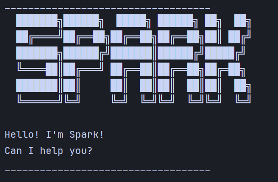

# Spark User Guide


Spark is a desktop **task management application that helps you keep track of your tasks (todos, deadlines, and events)**.

## Quick start
1. Ensure you have Java 17 or above installed on your computer.
2. Download the latest Spark.jar file from the releases page.
3. Copy the jar file to your desired folder.
4. Open a command terminal, navigate to the folder containing the jar file, and run `java -jar spark.jar`,
the application will start with a welcome message and be ready for your commands!

## Features
### Adding a Todo task: `todo`
Adds a simple task without any time constraints.<br/>
Format: `todo DESCRIPTION`<br/>
Examples:<br/>
* `todo Finish homework`
* `todo wash the dishes`


### Adding a deadline task: `deadline`
Adds a task with a specified due date/time.<br/>
Format: `deadline DESCRIPTION /by TIME`<br/>
Time Formats:
* `yyyy-MM-dd`
* `yyyy-MM-dd HHmm`<br/>

Examples:<br/>
* `deadline submit the report /by 2025-01-01`
* `deadline Eat the cake /by 2025-12-01 1600`


### Adding an event task: `event`
Adds a task with a start and end time. 
The start time and the end time should use the same format.<br/>
Format: `event DESCRIPTION /from START_TIME /to END_TIME`<br/>
Time Formats:
* `yyyy-MM-dd`
* `yyyy-MM-dd HHmm`<br/>

Examples:<br/>
* `event vacation /from 2025-09-22 /to 2025-09-28`
* `event meeting /from 2025-09-28 1000 /to 2025-09-28 1100`


### Listing all tasks: `list`
Shows all tasks in your task list.<br/>
Format: `list`<br/>


### Marking a task: `mark`
Marks a task as completed by index, and the information of the task will be displayed.<br/>
Format: `mark INDEX`<br/>
* Marks the task at the specified `INDEX` as completed.
* The index is the integer displayed in the list.<br/>

Example:<br/>
* `mark 1`<br/>

Expected outcome:
```
___________________________________
    Nice! This task is finished:
    [D][X] function test (by: Jan 01 2025)
___________________________________
```


### Unmarking a task: `unmark`
Marks a task as not done by index, and the information of the task will be displayed.<br/>
Format: `unmark INDEX`<br/>
* Marks the task at the specified `INDEX` as not done. If the task was not completed in the first place, there will be no change.
* The index is the integer displayed in the list.<br/>

Example:<br/>
* `unmark 1`

Expected outcome:
```
___________________________________
    OK, don't forget to do it:
    [D][ ] function test (by: Jan 01 2025)
___________________________________
```


### Deleting a task: `delete`
Removes a task from your list by index.
The information of the deleted task and the remaining number of tasks will be displayed.<br/>
Format: `delete INDEX`<br/>
* Deletes the task at the specified `INDEX`.
* The index is the integer displayed in the list.<br/>

Example:<br/>
* `delete 1`

Expected outcome:
```
___________________________________
    OK. I've removed this task:
    [D][ ] function test (by: Jan 01 2025)
    Now you have 5 tasks in the list.
___________________________________
```


### Finding Tasks by Date: `finddate`
Finds all tasks occurring on a specified date.
For deadline tasks, what is found are those that are due on the specified day.
For the event task, what is found are the tasks within the event time range on the specified date.<br/>
Format: `finddate DATE`<br/>
Date format: `yyyy-MM-dd`<br/>
Example:
* `finddate 2025-01-01`

Expected outcome:
```
___________________________________
Tasks on Jan 01 2025:
    1. [D][ ] a (by: Jan 01 2025 12:00)
___________________________________

```


### Finding Tasks by Keyword: `find`
Searches for tasks containing specified keywords.(Case-insensitive)<br/>
Format: `find KEYWORD`<br/>
Example:
* `find A`

Expected outcome:
```
___________________________________
Here are the tasks containing the keyword a :
    1. [D][ ] a (by: Jan 01 2025 12:00)
    2. [T][ ] task
    3. [E][ ] test spark (from: Sep 28 2025 12:00 to: Sep 29 2025 12:00)
___________________________________
```


### Viewing schedule: `schedule`
Displays all tasks sorted by time (events by start time, deadlines by due time, todos separately).<br/>
Format: `schedule`<br/>
Expected outcome:
```
___________________________________
Tasks sorted by time:
=== EVENTS (sorted by start time) ===
    1. [E][ ] c (from: Jan 01 2025 to: Jan 02 2025)
    2. [E][ ] test spark (from: Sep 28 2025 12:00 to: Sep 29 2025 12:00)

=== DEADLINE (sorted by due time) ===
    1. [D][ ] b (by: Mar 03 2000 16:00)
    2. [D][ ] a (by: Jan 01 2025 12:00)

=== TODOS (no time information) ===
    1. [T][ ] task
___________________________________
```


### Exiting the program: `bye`
Exits the application.<br/>
Format: `bye`<br/>

### Data Storage
Spark automatically saves your tasks to ./data/spark.txt after every command that modifies your task list.
You do not need to save manually.<br/>

## Command summary

| Command         | Format                                            |
|-----------------|---------------------------------------------------|
| Add todo        | `todo DESCRIPTION`                                |
| Add deadline    | `deadline DESCRIPTION /by TIME`                   |
| Add event       | `event DESCRIPTION /from START_TIME /to END_TIME` |
| List            | `list`                                            |
| Mark            | `mark INDEX`                                      |
| Unmark          | `unmark INDEX`                                    |
| Delete          | `delete INDEX`                                    |
| Find by date    | `finddate yyyy-MM-dd`                             |
| Find by keyword | `find KEYWORD`                                    |
| Schedule        | `schedule`                                        |
| Bye             | `bye`                                             |
